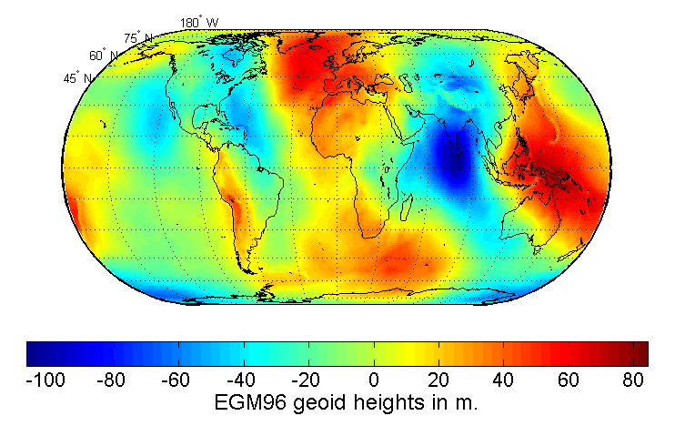
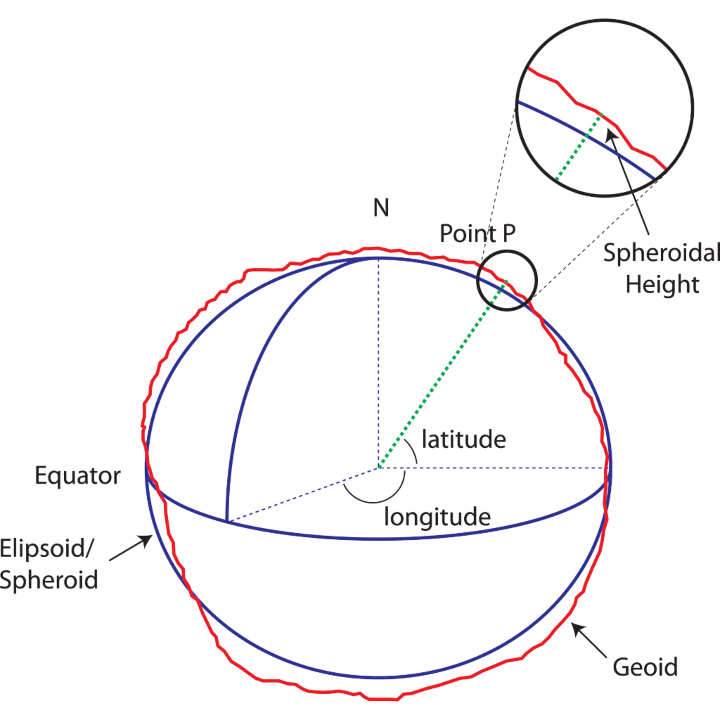

EGM96
=====

## Introduction

This C tools (library) is designed for the calculation of a geoid undulation at a point whose latitude and longitude is specified.

**TL:DR** It's meant to correct altitudes given by GPS systems, that mesure altitude against the ellipsoid and needs to be corrected to match the geoid.

### How to use

The library is meant to be easy to use.

* Include in your project the three files _egm96.c_, _egm96_gen.c_ and _egm96.h_ 
* Generate the one file _EGM96_data.h_
* Call the _egm96_compute_altitude_offset_ function:

```
/*!
 * \brief Compute the geoid undulation from the EGM96 potential coefficient model, for a given latitude and longitude.
 * \param latitude: Latitude in degrees.
 * \param longitude: Longitude in degrees.
 * \return The geoid undulation / altitude offset (in meters).
 */
double egm96_compute_altitude_offset(double lat, double lon);
```

### About the science

The [World Geodetic System](https://en.wikipedia.org/wiki/World_Geodetic_System) (WGS) is a standard for use in cartography, geodesy, and satellite navigation including GPS. This standard includes the definition of the coordinate system's fundamental and derived constants, the ellipsoidal (normal) [Earth Gravitational Model](https://en.wikipedia.org/wiki/Earth_Gravitational_Model) (EGM), a description of the associated [World Magnetic Model](https://en.wikipedia.org/wiki/World_Magnetic_Model) (WMM), and a current list of local datum transformations.

The **EGM96 geoid defines** the nominal sea level surface by means of a spherical harmonics series of degree 360. The deviations of the EGM96 geoid from the WGS 84 reference ellipsoid range from about −105 m to about +85 m.



In geodesy, a **reference ellipsoid** is a mathematically defined surface that approximates the geoid, which is the truer, imperfect figure of the Earth, or other planetary body, as opposed to a perfect, smooth, and unaltered sphere, which factors in the undulations of the bodies' gravity due to variations in the composition and density of the interior, as well as the subsequent flattening caused by the centrifugal force from the rotation of these massive objects (for planetary bodies that do rotate).



### About the original implementation

This project is a fork of [a project](https://sourceforge.net/projects/egm96-f477-c.) by D.Ineiev, containings a rought translation from Fortran to C of an [EGM96 implementation](https://earth-info.nga.mil/GandG/wgs84/gravitymod/egm96/egm96.html) from the [National Geospacial-intelligence Agency](https://earth-info.nga.mil/).


## Get involved!

You can browse the code on the GitHub page, submit patches and pull requests! Your help would be greatly appreciated ;-)


## License

```
Copyright (c) 2006 D.Ineiev <ineiev@yahoo.co.uk>
Copyright (c) 2020 Emeric Grange <emeric.grange@gmail.com>

This software is provided 'as-is', without any express or implied warranty.
In no event will the authors be held liable for any damages arising from
the use of this software.

Permission is granted to anyone to use this software for any purpose,
including commercial applications, and to alter it and redistribute it
freely, subject to the following restrictions:

1. The origin of this software must not be misrepresented; you must not
   claim that you wrote the original software. If you use this software
   in a product, an acknowledgment in the product documentation would be
   appreciated but is not required.
2. Altered source versions must be plainly marked as such, and must not be
   misrepresented as being the original software.
3. This notice may not be removed or altered from any source distribution.
```
